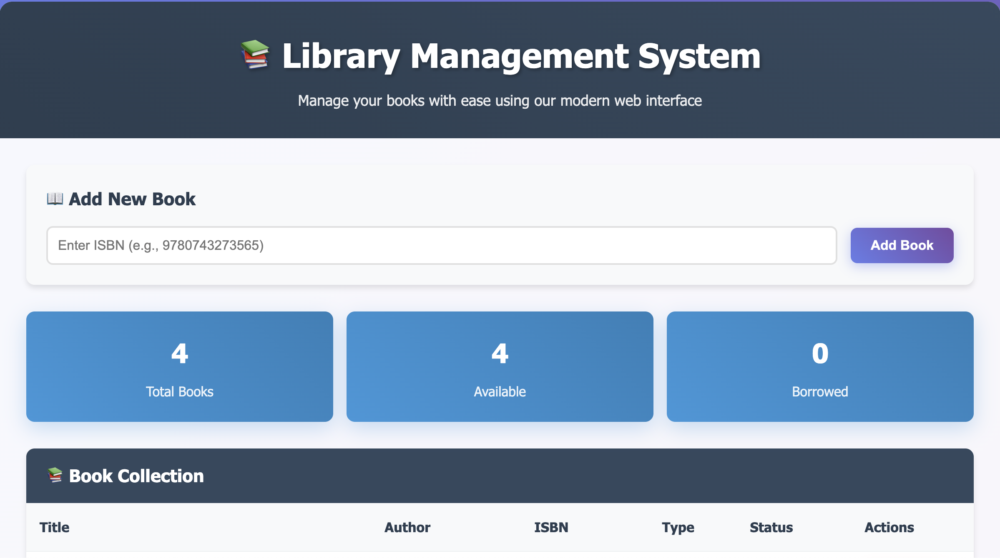
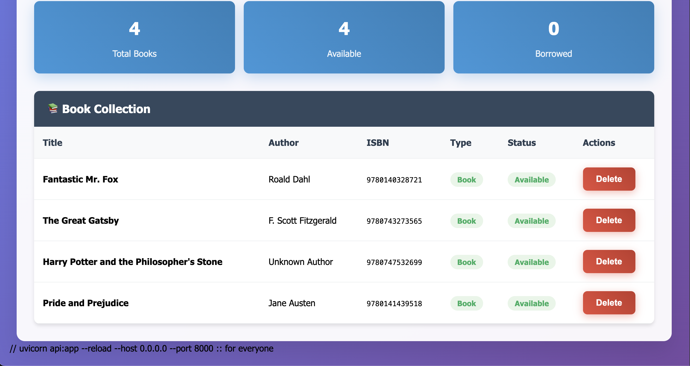

# 📚 Library Management System

A simple yet powerful library management system built with **Python**, **FastAPI**, and a **web interface**.

## 🚀 What This Project Does

This is a 3-stage library management system:

- **Stage 1**: Command line application with OOP  
- **Stage 2**: API integration with Open Library  
- **Stage 3**: FastAPI web service with HTML interface

---


## ✨ Features

- Add, remove, search books  
- Automatic book info from ISBN using Open Library API  
- Member management and book borrowing  
- Different book types: `Book`, `EBook`, `AudioBook`  
- REST API with FastAPI  
- Simple web interface  
- JSON data storage  
- Complete tests with pytest  

---

## 📁 Project Files

```
project/
├── main.py              # Command line app
├── api.py               # FastAPI web service  
├── book.py              # Book classes
├── library.py           # Library management
├── member.py            # Member class
├── member_manager.py    # Member management
├── web_interface.html   # Web interface
├── test_library.py      # Library tests
├── test_api.py          # API tests
├── requirements.txt     # Dependencies
├── library.json         # Book data
└── members.json         # Member data
```

---

## 🛠️ Installation

1. **Clone the project:**
```bash
git clone <your-repo-url>
cd library-management-system
```

2. **Install dependencies:**
```bash
pip install -r requirements.txt
```

---

## ▶️ How to Run

### 🖥️ Command Line Application
```bash
python main.py
```

Choose from menu:
- Add Book (manual or by ISBN)  
- Remove Book  
- List Books  
- Search Book  
- Add Member  
- List Members  
- Borrow Book  
- Return Book  

### 🌐 FastAPI Web Service
```bash
uvicorn api:app --reload
```

Then visit:
- API docs: http://127.0.0.1:8000/docs  
- Health check: http://127.0.0.1:8000/health  

### 🧑‍💻 Web Interface

1. Start the API server first  
2. Open `web_interface.html` in your browser  

---

## 🔗 API Endpoints

| Method | URL | Description | Example |
|--------|-----|-------------|---------|
| GET | `/books` | Get all books | - |
| POST | `/books` | Add book by ISBN | `{"isbn": "9780743273565"}` |  
| GET | `/books/{isbn}` | Get one book | - |
| DELETE | `/books/{isbn}` | Delete book | - |
| GET | `/health` | Check if API works | - |

---

## 📦 API Examples

**Get all books:**
```bash
curl http://127.0.0.1:8000/books
```

**Add book by ISBN:**
```bash
curl -X POST http://127.0.0.1:8000/books \
  -H "Content-Type: application/json" \
  -d '{"isbn":"9780743273565"}'
```

**Delete book:**
```bash
curl -X DELETE http://127.0.0.1:8000/books/9780743273565
```

---

## ✅ Testing

Run all tests:
```bash
pytest -v
```

Run specific tests:
```bash
pytest test_library.py -v    # Library tests
pytest test_api.py -v        # API tests
```

---

## 📚 Book Types



**Regular Book:**
```python
Book(title="1984", author="George Orwell", isbn="9780451524935")
```

**EBook:**
```python
EBook(title="Digital Book", author="Author", isbn="123", file_format="PDF")
```

**AudioBook:**  
```python
AudioBook(title="Audio Story", author="Author", isbn="456", duration=180)
```

---

## 📦 Dependencies

- `httpx` - For API calls to Open Library  
- `fastapi` - Web framework  
- `uvicorn` - ASGI server  
- `pytest` - Testing framework  
- `pydantic` - Data validation  

---

## 💾 Data Storage
- Books stored in `library.json`  
- Members stored in `members.json`  
- Uses JSON format for easy reading  

---

## 🌐 API Integration

Uses Open Library API to get book info by ISBN:
- URL: `https://openlibrary.org/isbn/{isbn}.json`  
- Gets title and author automatically  
- Handles errors when book not found  

---

## ⚠️ Error Handling

- Network errors when API is down  
- Invalid ISBN numbers  
- Duplicate books  
- Books not found  
- Borrowed books cannot be deleted  

---

## 🖥️ Web Interface Features

- View all books in a table  
- Add new books by ISBN  
- Delete books with confirmation  
- Responsive design  
- Real-time updates  
- Error messages for user  

---

## 🧱 Project Structure Explained

**Stage 1 Files:**
- `book.py` - Book classes with OOP  
- `library.py` - Library management  
- `main.py` - Command line interface  

**Stage 2 Additions:**
- API integration in `library.py`  
- Error handling for network calls  
- Tests for API functionality  

**Stage 3 Additions:**  
- `api.py` - FastAPI web service  
- `web_interface.html` - Web frontend  
- API tests and documentation  

---

## 🧪 Testing Coverage

Tests cover:
- Book creation and methods  
- Library operations (add, remove, find)  
- API integration with mocking  
- FastAPI endpoints  
- Error conditions  
- Data persistence  

---

## 🔮 Future Ideas

- SQLite database instead of JSON  
- User authentication  
- Book recommendations  
- Email notifications  
- Mobile app  
- Docker containerization  
